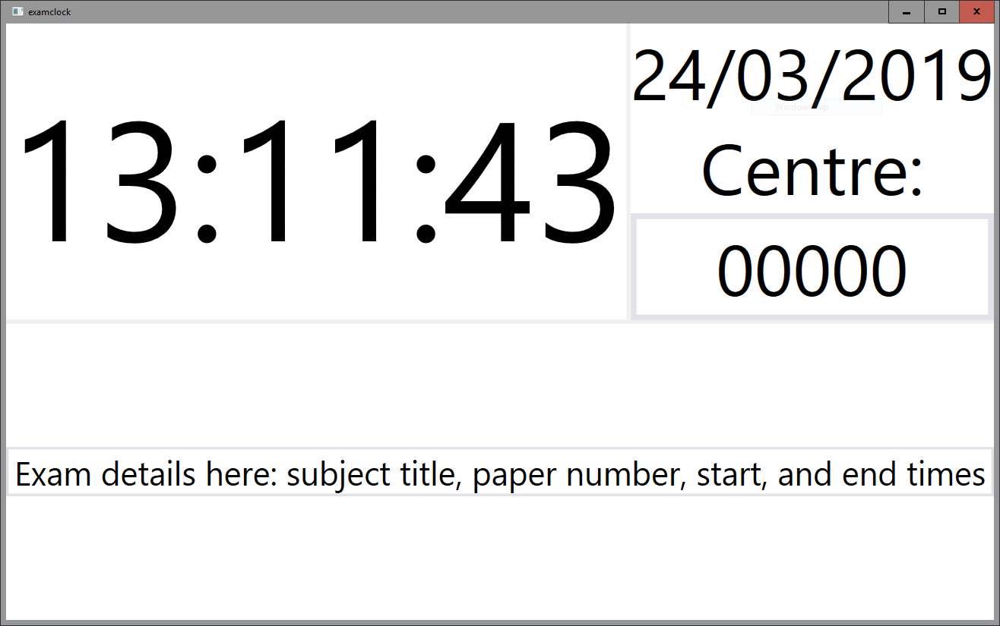

A clock/display for examinations, aimed to meet JCQ rules.

_[JCQ Instructions for Conduction Examinations, Section 11](https://www.jcq.org.uk/exams-office/ice---instructions-for-conducting-examinations/instructions-for-conducting-examinations-2018-2019)_

11.7 A reliable clock (analogue or digital) must be visible to each candidate in the examination room.
- The clock must be big enough for all candidates to read clearly.
- The clock must show the actual time at which the examination starts.
- Countdown and ‘count up’ clocks are not permissible.

11.9 A board/flipchart/whiteboard should be visible to all candidates showing the:
- a) centre number, subject title and paper number; and
- b) the actual starting and finishing times, and date, of each examination.

## Running

`examclock.exe` and an MSI installer are available on [the releases page](https://github.com/theaquamarine/examclock/releases).

## Configuration

The centre number displayed by default can be set using a string value for `CentreNumber` on the registry keys `SOFTWARE\examclock` in HKEY_CURRENT_USER or HKEY_LOCAL_MACHINE.

HKCU is prioritised over HKLM, and a centre number set by the user will be saved there.
